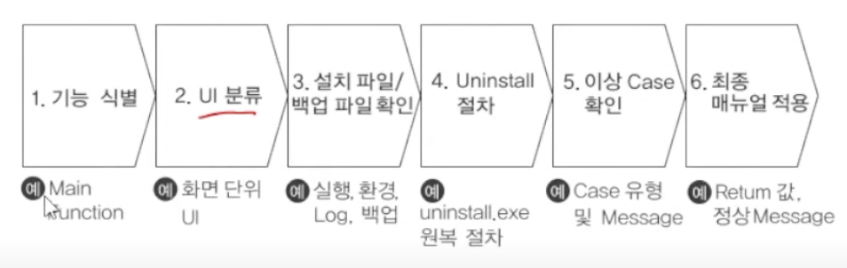
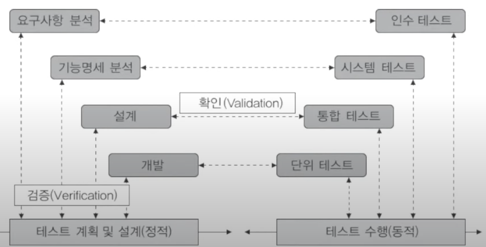

# 20. 통합 구현
## 단위 모듈 구현
### 단위 모듈
* 하나의 기능을 하는 프로그램

### 모듈화의 원리
* 분할과 지배 (Divide & Conquer)
* 정보 은폐
* 자료 추상화
* 모듈의 독립성

### 단위 모듈 테스트

### 구현 단계의 작업 절차
코딩 계획 -> 코딩 -> 컴파일 -> 테스트

## 통합 개발 환경
### IDE
* C++, Java 등의 언어를 이용한 소프트웨어 개발 단계에서 패키지 인크루팅, 소스코드 편집, 컴파일, 디버깅, 바이너리 배포 등 모든 작업을 통합 지원한다.

### 빌드 자동화 도구
* 프로세스: 컴파일 -> 패키징 -> 단위 테스트 -> 정적 분석 -> 리포팅 -> 배포 -> 최종 빌드
* Ant, Maven, Gradle, Jenkins 

# 21. 제품 소프트웨어 패키징
## 애플리케이션 패키징
## 제품 소프트웨어의 패키징 도구
### 패키징 도구

### 패키징 도구 활용 시 고려사항 (21.5, 20.9, 20.8, 20.6)
* 사용자에게 배포되는 소프트웨어임을 고려하여 반드시 내부 콘텐츠에 대한 암호화 및 보안을 고려한다.
* 다양한 이기종 콘텐츠 및 단말기 간 DRM 연동을 고려한다.
* 사용자 편의성을 위한 복잡성 및 비효율성 문제를 고려한다.
* 제품 소프트웨어에 적합한 암호화 알고리즘을 적용하여 범용성에 지장이 없도록 한다.

### 구성 요소
* 암호화
* 키 관리
* 암호 파일 생성
* 식별 기술
* 저작권 표현
* 정책 관리
* 크랙 방지
* 인증

## 모니터링 도구와 협업 도구
### 애플리케이션 모니터링 도구 (APM)
### 협업 도구
* 이해관계자 간의 지속적 이견 조율 과정을 위한 도구

# 22. 제품 소프트웨어 저작권
## 제품 소프트웨어 저작권 보호
### DRM(Digital Rights Management)
* 디지털 콘텐츠의 생성에서부터 실제 사용자까지 모든 유통 과정에 걸쳐 콘텐츠를 안전하게 관리 및 보호하고 허가된 사용자만이 접근할 수 있도록 제한하는 기술이다.

### DRM의 특성
* 거래 투명성
* 사용 규칙 제공
* 자유로운 상거래 제공

### DRM의 기술 요소 (21.3, 20.9, 20.8, 20.6)
* 암호화
* 키 관리
* 암호화 파일 생성
* 식별 기술
* 저작권 표현
* 정책 관리
* 크랙 방지
* 인증
* 인터페이스
* 이벤트 보고

### DRM의 유통 과정과 구성
* 클리어링하우스
      ^         v   ^  
* 콘텐츠 제공 -> 콘텐츠 분배 
* 콘텐츠 제공자: 저작권자
* 콘텐츠 분배자: 암호화된 콘텐츠 제공
* 패키저
* 보안 컨테이너
* DRM 컨트롤러
* 클리어링 하우스: 키 관리 및 라이선스 발급 관리, 저작권료의 정산 및 분배

### 사용 권한 유형
* 렌더 퍼미션: 사용자에게 콘텐츠가 표현되고 이용되는 권리 형태를 정의 ex) 문서, 동영상
* 트랜스포트 퍼미션: 사용자들 간에 권리 교환이 이루어지는 권리 형태를 정의 ex) 카피, 무브, 론
* 데리버티브 퍼미션: 콘텐츠의 추출 변형이 가능한 권한 ex) 익스트랙드, 임베드, 에디트

# 23. 제품 소프트웨어 매뉴얼 작성
## 소프트웨어 매뉴얼

### 소프트웨어 설치 매뉴얼
* 소프트웨어 실사용자가 제품을 최초 설치 시 참조하는 매뉴
* 제품 소프트웨어 소개, 설치 파일, 설치 절차 등

### 설치 매뉴얼 구성
* 목차 및 개요
* 문서 이력 정보: 매뉴얼 변경 이력에 대한 정보를 버전별, 시간순으로 작성
* 설치 매뉴얼 주석
  * 주의 사항
  * 참고 사항 
* 설치 도구의 구성
* 설치 위치 지정

### 소프트웨어 설치 매뉴얼 기본 사항
* 제품 소프트웨어 개요, 설치 관련 파일, 설치 아이콘, 프로그램 삭제, 관련 추가 정보

### 소프트웨어 설치 환경 체크 항목
* 사용자 환경, 설치 시 실행 중인 다른 프로그램 종료, 업그레이드 버전 존재 여부 확인, 백업 폴더 확인

### 소프트웨어 설치 매뉴얼 작성 프로세스

## 소프트웨어 사용자 매뉴얼
### 사용자 매뉴얼
### 사용자 매뉴얼의 구성
### 사용자 매뉴얼 작성 프로세스 (21.8)
작성 지침 정의 -> 구성 요소 정의 -> 구성 요소별 내용 작성 -> 사용자 매뉴얼 검토
### 소프트웨어 국제 표준 품질 특성
* ISO/IEC 9126 - 소프트웨어 품질 특성과 척도에 관한 지침
* ISO/IEC 12119 (20.8) - 품질 모델을 따르며 패키지 소프트웨어의 일반적인 제품 품질 요구사항 및 테스트를 위한 국제 표준
* ISO/IEC 15504
* ISO 9001 - 설계, 개발, 생산, 설치, 서비스 과정에 대한 품질 보증 모델
### 소프트웨어 품질 목표 (21.8, 21.3, 20.9)
* 운영 특성
  * 정확성
  * 신뢰성
  * 사용 용이성
  * 효율성
  * 무결성
* 변경 수용 특성
  * 이식성
  * 상호운용성
  * 재사용성
  * 유연성
  * 유지보수성
  * 시험 역량
### 소프트웨어 품질 측정 시 관점별 분류
* 사용자 관점: 신뢰성, 효율성, 사용 용이성, 간결성
* 개발자 관점: 검증 가능성, 유지보수성, 이식성, 무결성, 사용성
* 프로젝트 관리자 관점: 생산성과 제어 용이성

## 릴리즈 노트 작성하기

### 릴리즈 노트
* 애플리케이션의 최종 사용자인 고객에게 제공하는 문서

### 작성 항목
* 헤더: 문서명, 제품명, 배포버전 번호, 릴리즈 날짜, 참고 날짜, 문서 버전
* 개요
* 목적
* 이슈 요약
* 재현 항목
* 수정 및 개선 내용
* 최종 사용자 영향도
* 노트
* 면책조항
* 연락처

# 24. 형상 관리
## 형상 관리 도구
### 형상 관리
* 개발 단계에 생성되는 모든 문서, 코드 등 소프트웨어의 변경사항을 체계적으로 관리하기 위하여 추적하고 통제하는 것이다.

### 형상 관리 항목
* 프로젝트 요구 분석서, 운영 및 설치 지침서, 요구사항 명세서, 설계/인터페이스 명세서, 테스트 설계서, 소프트웨어 품질보증, 형상 관리, V&V 계획서, 코드 모듈

### 형상 관리 종류
* 버전 관리
* 변경 관리

### 형상 관리 도구 (20.8)
* 
*

### 형상 관리 절차 (21.8)
* 형상 식별
* 형상 통제: 형상통제위원회 운영을 통하여 변경 통제가 이루어져야 한다. 기준선에 대한 관리 및 형상 통제 수행
* 형상 보고 및 감사
  * 형상 감사 시 고려사항
    
형상 관리 > 버전 관리 > 변경 관리

## 버전 관리 도구

### 버전 관리 도구 구분
* 공유 폴더 방식
  * 담당자 한 명이 폴더 하나를 공유
* 클라이언트/서버 방식
  * SVN, CVS
* 분산 저장소 방식
  * Git
  * 원격 저장소와 로컬 저장소에 함께 저장되어 관리

### 주요 도구
* CVS
  * 동시 버전 시스템
  * 파일로 이뤄진 모든 작업과 모든 변화를 추적하고 여러 개발자가 협력하여 작업할 수 있게 한다.
* RCS
  * CVS와의 차이점은 수정을 한 사람만 할 수 있다.
* SVN
  * CVS보다 속도 개선
  * repository
  * trunk
  * branch
* Bit-keeper
* Git
  * 지역 저장소/원격 저장소

### 컴포넌트 저장소 (리포지토리)

### Git 주요 명령어
* init
* add
* commit
* branch
* checkout
* merge
* fetch
* pull
* remote
* clone

### SVN 주요 명령어
* import: 저장소에 맨 처음 소스 파일을 저장
* check-in
* check-out
* commit
* diff
* update
* branch
* fork
* update
* info
* merge

# 25. 애플리케이션 테스트 관리
## 테스트 케이스
### 소프트웨어 테스트 (*)
* 품질 향상 관점: 반복적인 테스트를 거쳐 제품의 신뢰도를 향상하는 품질 보증 활동
* 오류 발견 관점: 잠재된 오류를 발견하고 이를 수정하여 올바를 프로그램을 개발하는 활동
* 오류 예방 관점: 코드 리뷰, 동료 검토, 인스펙션 등을 통해 오류를 사전에 발견하는 활동

### 소프트웨어 테스트의 원리 (쭉 보면서 정리)
* 결함 집중: 결함의 대부분은 소수의 특정한 모듈에 집중되어 존재한다!
* 살충제 패러독스: 동일한 테스트 케이스로 반복 테스트 시 결함을 발견할 수 없으므로 주기적으로 테스트 케이스를 리뷰하고 개선해야 한다.
* 오류-부제의 궤변: 오류를 제거했다고 오류가 없다고 말할 수 없음

### 파레토의 법칙 (20.6)
* 80 대 20 법칙 혹은 2 대 8 법칙이라고도 함
* 전체 결과의 80%가 전체 원인의 20%에서 일어나는 현상

### 테스트 케이스
* 구현된 소프트웨어가 사용자의 요구사항을 정확하게 준수했는지

### 테스트 케이스 과정 (이따 봄)

### 테스트 프로세스
계획 및 제어 -> 분석 및 설계 -> 구현 및 실현 -> 평가 -> 완료

### 테스트 커버리지 (유력)
테스트 수행 정도로서 구문 커버리지, 결정 커버리지, 조건 커버리지, 조건/결정 커버리지, 변경 조건/결정 커버리지, 다중 조건 커버리지로 구분

### 테스트 오라클
테스트의 결과가 참인지 거짓인지를 판단하기 위해서 사전에 정의된 참값을 입력하여 비교하는 기법 및 활동
* 참 오라클: 모든 입력값에 대하여 적합한 결과를 생성
* 일관성 검사 오라클: 수행 전과 후의 결과값이 동일한지?
* 샘플링 오라클: 입력값을 샘플링
* 휴리스틱 오라클: 샘플링 오라클의 개선 - 나머지 값들은 휴리스틱(추정)으로 처리

### V-모델과 테스트

### 시각에 따른 테스트
* 검증(Verification) 테스트: 제품이 명세서대로 완성되었는지 개발자의 시각에서 테스트
* 확인(Validation) 테스트: 제품에 요구사항이 반영됐는지 사용자의 시각에서 테스트

### 테스트 케이스 자동 생성 (21.8)
자료 흐름도 -> 테스트 경로 관리, 입력 도메인 분석 -> 테스트 데이터 산출, 랜덤 테스트 -> 무작위 값 입력, 신뢰성 검사

### 테스트 레벨의 종류
* 단위 테스트 (21.8, 21.5): 특정 모듈에 대한 테스트, 객체지향에서 클래스 테스팅
* 통합 테스트: 단위 테스트를 통과한 개발 소프트웨어/하드웨어 컴포넌트 간 인터페이스 및 연동 기능 등을 구조적으로 접근하여 테스트
* 시스템 테스트: 실제 환경과 가능한 유사한 환경에서 진행하며 시스템 성능과 관련된 요구사항이 완벽하게 수행되는지 테스트하므로 사전 요구사항이 명확해야 한다.
* 인수 테스트: 실 사용자 환경에서 사용자가 테스트
  * 알파 테스트: 개발자 관점에서 수행, 개발사 내 다른 인원이 테스트
  * 베타 테스트: 선정된 다수의 사용자가 자신의 사용 환경에서 일정 기간 사용하면서 테스트

### 어플리케이션 테스트
* 정적 테스트
  * 애플리케이션을 직접 실행하지 않고 명세서나 소스코드를 대상으로 분석하는 테스트 방식
  * 소프트웨어 개발 초기에 결함 발견이 가능하여 개발 비용을 낮출 수 있다.
  * 종류 보자!
* 동적 테스트
  * 애플리케이션을 직접 실행하여 오류를 찾는 방식
  * 블랙박스 테스트 (명세 기반), 화이트박스 테스트 (구조 기반)
  * 세부 종류 보자!

### 테스트 기반에 따른 테스트
* 구조 기반 테스트
  * 소프트웨어 내부의 구조에 따라 테스트 케이스를 작성하고 확인
  * 종류: 
* 명세 기반 테스트
  * 사용자의 요구사항에 대한 명세를 기반으로 테스트 케이스를 작성하고 확인
  * 종류: 
* 경험 기반 테스트
  * 테스터의 경험에 따른 테스트

### 목적에 따른 테스트
* 성능, 구조, 회귀, 안전, 강도, 병행

# 26. 테스트 시나리오와 테스트 기법

# 27. 테스트 커버리지

# 28. 통합 테스트

# 29. 결함 관리

# 30. 애플리케이션 성능 개선

# 31. 소스 코드 최적화

# 32. 인터페이스 구현

# 33. 인터페이스 보안
