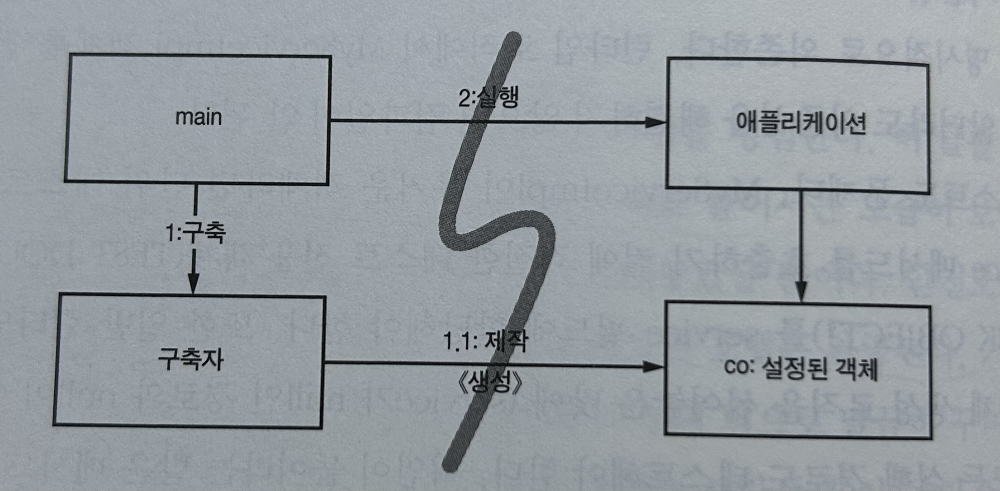
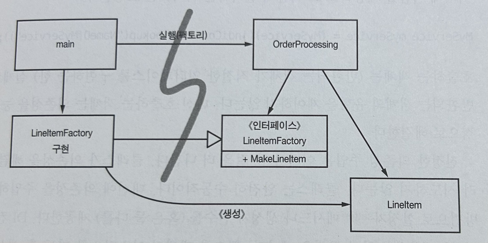

# 11장: 시스템

## 도시를 세운다면? (`194p`)
- 도시는 혼자서의 힘으로는 관리할 수 없다. 도시의 각 분야를 관리하는 팀이 있기에 돌아간다.
- 도시가 돌아가는 또 다른 이유는 적절한 추상화와 모듈화 덕분이다. 큰 그림을 이해하지 못하더라도 개인과 개인이 관리하는 구성요소는 효율적으로 돌아간다.
- 소프트웨어 팀도 도시처럼 구성한다. 그런데 막상 팀이 제작하는 시스템은 비슷한 수준으로 관심사를 분리하거나 추상화를 이뤄내지 못한다.
- 높은 추상화 수준, 즉 **시스템** 수준에서도 깨끗함을 유지할 수 있는 방법이 있을까?

## 시스템 제작과 시스템 사용을 분리하라 (`194p`)
- **관심사 분리**는 우리 분야에서 가장 오래되고 가장 중요한 설계 기법!

### 예시
```java
public Servie getService() {
  if (service == null) {
    service = new MyServiceImpl(...);
  }
  return service;
}
```
- 위의 코드는 초기화 지연(계산 지연) 기법이다.
- 초기화 지연 기법의 장점
  - 필요할 때까지 객체를 생성하지 않으므로 필요한 부하가 걸리지 않음.
  - 어떤 경우에도 null을 반환하지 않는다.
- 단점은?
  - getService 메서드가 MyServiceImpl과 생성자 인수에 명시적으로 의존한다.
  - 런타임에서 해당 객체를 사용하지 않더라도 의존성을 해결하지 않으면 컴파일이 불가능하다 (null이니까)
  - 일반 런타임 로직에 객체 생성 로직을 섞어놓았으므로, 책임이 두객가 되며 단일 책임 원칙을 위반한다!
- 체계적이고 탄탄한 시스템의 기본 -> 좀스럽고 손쉬운 기법으로 모듈성을 깨지 말자!

### Main 분리 (`196p`)

- 시스템 생성과 시스템 사용을 분리하는 한 가지 방법
- 생성과 관련된 코드는 main(혹은 main이 호출하는 모듈)에, 나머지 시스템은 모든 객체가 생성되었고 모든 의존성이 연결
- 모든 화살표가 main에서 애플리케이션 쪽을 향한다. 즉, 애플리케이션은 main이나 객체가 생성되는 과정을 모른다!

### 팩토리 (`197p`)

- 객체가 생성되는 시점을 애플리케이션이 결정해야 한다면, 추상 팩토리 패턴을 사용한다.
- 여기도 마찬가지로 모든 의존성이 main에서 OrderProcessing 애플리케이션으로 향한다.
- OrderProcessing 애플리케이션은 LineItem이 생성되는 구체적인 방법을 모르나, 이 인스턴스가 생성되는 시점을 완벽하게 통제할 수 있다.

### 의존성 주입 (`198p`)
- 사용과 제작을 분리하는 강력한 메커니즘! 제어 역전 기법을 의존성 관리에 적용한 메커니즘이다.
- 초기 설정은 시스템 전체에서 필요하므로 대개 '책임질' 메커니즘으로 'main' 루틴이나 특수 컨테이너를 사용한다.

## 확장 (`199p`)
- 처음부터 올바르게 시스템을 만들 수 있다는 믿음은 미신이다.
- 대신에 우리는 오늘 주어진 사용자 스토리에 맞춰 시스템을 구현해야 한다. 내일은 새로운 스토리에 맞춰 시스템을 조정하고 확장하면 된다. -> 반복적, 점진적인 애자일의 핵심
- 시스템 역시 관심사를 적절히 분리해 관리한다면 점진적으로 발전할 수 있다.

### 횡단 관심사 (`202p`)
- 영속성과 같은 **관심사**는 애플리케이션의 자연스러운 객체 경계를 넘나드는 경향이 있다. 모든 객체가 전반적으로 동일한 방식을 이용하게 만들어야 한다.
- 현실적으로는 영속성 방식을 구현한 코드가 온갖 객체로 흩어진다. -> 이때 필요한 개념이 **횡단 관심사**!

### AOP
- 관점 지향 프로그래밍
- 횡단 관심사에 대처해 모듈성을 확보하는 일반적인 방법론이다.
- 관점 (Aspect): 특정 관심사를 지원하려면 시스템에서 특정 지점들이 동작하는 방식을 일관성 있게 바꿔야 한다.

## 자바 AOP 메커니즘

### 자바 프록시 (`203p`)
- 단순한 상황에 적합하다.
- 개별 객체나 클래스에서 메서드 호출을 감싸는 경우가 좋은 예다.
- JDK에서 제공하는 동적 프록시는 인터페이스만 지원하므로, 클래스 프록시는 CGLIB, ASM, Javassist 등과 같은 바이트코드 처리 라이브러리가 필요하다.

### 순수 자바 AOP 프레임워크 (`205p`)
- 대부분의 프록시 코드는 판박이라 도구로 자동화할 수 있다.
- 순수 자바 관점을 구현하는 Spring AOP, JBoss AOP 등과 같은 여러 자바 프레임워크는 내부적으로 프록시를 사용한다.
- 스프링
  - 비즈니스 로직을 POJO로 구현한다.
  - POJO는 순수하게 도메인에 초점을 맞추고, 엔터프라이즈 프레임워크에도 의존하지 않는다.

### AspectJ 관점 (`209p`)
- AspectJ는 언어 차원에서 관점을 모듈화 구성으로 지원하는 자바 언어 확장이다.
- 관점을 분리하는 강력하고 풍부한 도구 집합을 제공하긴 하지만, 새 도구를 사용하고 새 언어 문법과 사용법을 익혀야 한다는 단점이 있다.
- 최근의 AspectJ 애너테이션 폼은 새로운 도구와 새로운 언어라는 부담을 완화한다

## 테스트 주도 시스템 아키텍처 구축 (`210p`)
- 관점으로 (혹은 유사한 개념으로) 관심사를 분리하는 방식은 그 위력이 막강하다.
- 애플리케이션 도메인 논리를 POJO로 작성할 수 있다면, 즉 코드 수준에서 아키텍처 관심사를 분리할 수 있다면 진정한 테스트 주도 아키텍처 구축이 가능해진다.

## 의사 결정을 최적화하라 (`211p`)
- 모듈을 나누고 관심사를 분리하면 지엽적인 관리와 결정이 가능해진다.
- 때때로 가능한 마지막 순간까지 결정을 미루는 방법이 최선이라는 사실을 까먹곤 한다.
- 너무 일찍 결정하면 고객 피드백을 더 모으고, 프로젝트를 더 고민하고, 구현 방안을 더 탐험할 기회가 사라진다.

## 명백한 가치가 있을 때 표준을 현명하게 사용하라 (`211p`)
- EJB2는 표준이라는 이유만으로 많은 팀이 사용했다. 그러나, 이런 표준에 너무 집착하면 고객 가치가 뒷전으로 밀려날 수 있다.

## 시스템은 도메인 특화 언어가 필요하다 (`212p`)
- 도메인 특화 언어?
  - 간단한 스크립트 언어나 표준 언어로 구현한 API
  - DSL로 짠 코드는 도메인 전문가가 작성한 구조적인 산문처럼 읽힌다.
- 좋은 DSL은 도메인 개념과 그 개념을 구현한 코드 사이에 존재하는 의사소통 간극을 줄여준다.
- 효과적으로 사용한다면 DSL은 추상화 수준을 코드 관용구나 디자인 패턴 이상으로 끌어올린다.
